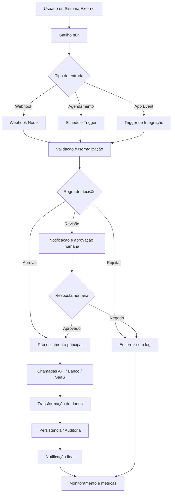

# 20_03

Versão 100% focada em **n8n**.

Este repositório passa a ter escopo exclusivo para conteúdos, ideias e implementações relacionadas ao ecossistema **n8n**.

## Escopo

- automações e workflows no n8n
- integrações com APIs, webhooks e bancos de dados via n8n
- uso de nós, credenciais, gatilhos e expressões do n8n
- operação, organização e boas práticas de instâncias n8n

## Fora de escopo

- soluções genéricas que não sejam centradas em n8n
- materiais sobre automação sem aplicação direta no n8n

## Análise Dupla

### 1. Análise de Produto

- **Problema:** equipes precisam desenhar, documentar e operar automações com rapidez, clareza e baixo atrito.
- **Oportunidade:** usar o n8n como núcleo de orquestração visual para conectar sistemas, reduzir trabalho manual e acelerar entregas.
- **Valor principal:** centralizar fluxos, integrações, webhooks, regras e observabilidade em uma camada única de automação.
- **Resultado esperado:** workflows mais rápidos de construir, mais simples de manter e mais fáceis de explicar para times técnicos e de negócio.

### 2. Análise Técnica

- **Arquitetura base:** gatilhos no n8n iniciam workflows que processam dados, chamam APIs, executam regras, persistem estados e notificam usuários.
- **Capacidades-chave:** uso de nodes nativos, HTTP Request, Webhook, Code, IF, Switch, Wait, bancos, filas e integrações externas.
- **Pontos críticos:** credenciais seguras, tratamento de erro, retries, observabilidade, versionamento de workflows e controle de execução.
- **Critério técnico de sucesso:** fluxos reutilizáveis, monitoráveis e fáceis de adaptar a múltiplos cenários de integração.

## Mermaid Completo

## PRD Completo

### 1. Visão do Produto

Criar uma base documental e estrutural totalmente orientada a **n8n**, capaz de servir como referência para desenhar automações, integrações e fluxos operacionais com documentação clara, visual e acionável.

### 2. Objetivo

Permitir que qualquer iniciativa deste repositório seja descrita e evoluída a partir de:

- uma análise dupla: produto + técnica
- um diagrama Mermaid que represente o fluxo n8n
- um PRD que traduza objetivo, requisitos, métricas e restrições

### 3. Público-Alvo

- operadores de automação
- times de operações
- analistas de processos
- desenvolvedores que implementam integrações no n8n
- stakeholders que precisam validar fluxos sem entrar em detalhes excessivos de código

### 4. Problema a Resolver

Projetos de automação frequentemente sofrem com documentação incompleta, ausência de visão visual do fluxo e requisitos vagos. O resultado é retrabalho, baixa previsibilidade e manutenção cara.

### 5. Solução Proposta

Padronizar o material do repositório para que toda iniciativa n8n seja descrita por:

1. **Análise de Produto** para justificar valor, contexto e resultado esperado  
2. **Análise Técnica** para descrever arquitetura, nodes, integrações e riscos  
3. **Mermaid** para comunicar o fluxo de ponta a ponta  
4. **PRD** para consolidar requisitos funcionais e não funcionais

### 6. Requisitos Funcionais

- o conteúdo deve ser exclusivamente centrado em n8n
- cada solução deve explicar gatilhos, processamento, integrações e saídas
- cada fluxo deve indicar decisões, exceções e pontos de observabilidade
- a documentação deve ser legível por perfis técnicos e não técnicos
- o diagrama Mermaid deve refletir o funcionamento do workflow de forma fiel

### 7. Requisitos Não Funcionais

- clareza de leitura
- fácil manutenção
- padronização de estrutura
- rastreabilidade de decisões
- foco em segurança de credenciais e dados

### 8. Métricas de Sucesso

- redução do tempo para entendimento de um workflow
- maior velocidade para criar ou adaptar automações no n8n
- menor ambiguidade entre requisito e implementação
- melhoria na comunicação entre negócio e time técnico

### 9. Restrições

- manter escopo 100% n8n
- evitar generalizações fora do contexto de automação no n8n
- não depender de documentação dispersa para explicar o fluxo principal

### 10. Fora de Escopo

- automações sem ligação direta com n8n
- documentação genérica de produto sem fluxo operacional
- diagramas sem correspondência com execução real do workflow

### 11. Riscos

- documentação ficar desatualizada em relação ao workflow real
- excesso de simplificação esconder regras críticas
- falta de padronização entre futuros materiais do repositório

### 12. Próximos Passos

- detalhar casos de uso n8n por domínio
- adicionar exemplos concretos de workflows
- evoluir os diagramas Mermaid por cenário
- transformar o PRD em base para implementação e revisão contínua
