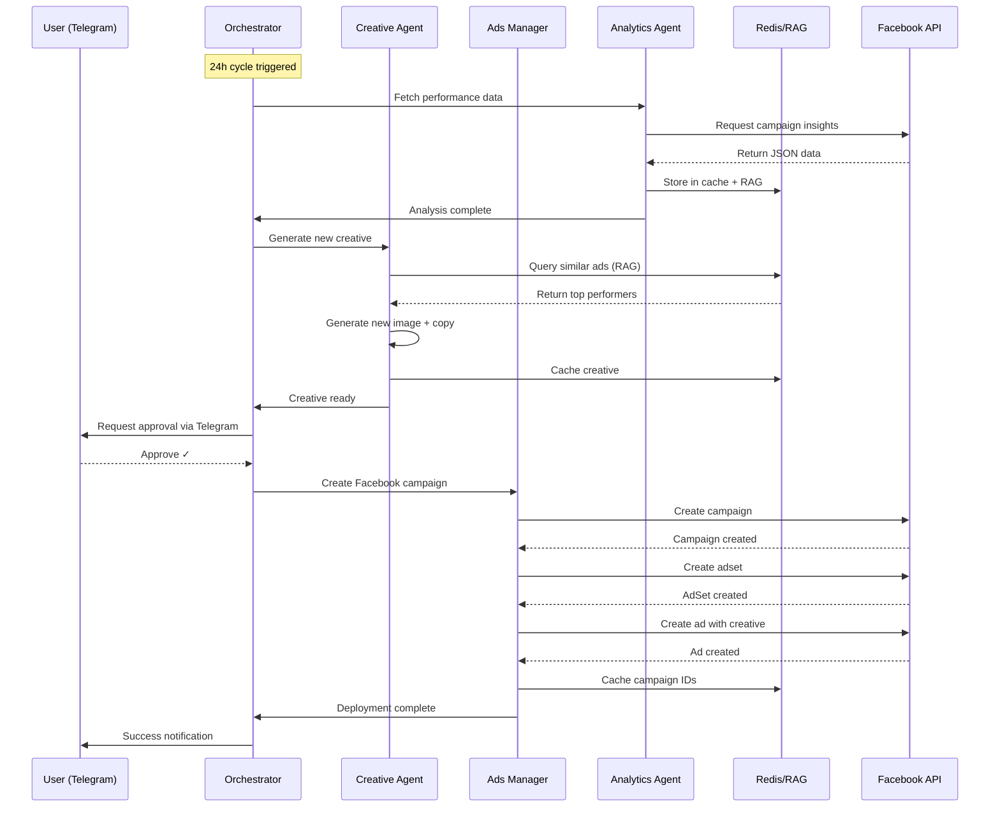
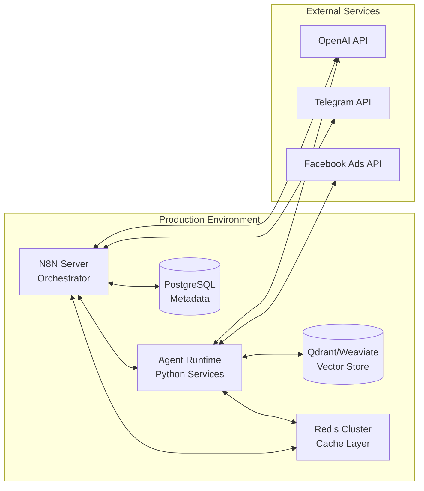

# Marketing Automation System Architecture

## Ultra-Robust Professional Marketing Automation System
### Complete Marketing Team Replacement with AI Agents

```mermaid
graph TB
    subgraph "USER INTERFACE"
        TG[Telegram Bot<br/>User Approval Gateway]
        DASH[Analytics Dashboard<br/>Real-time Metrics]
    end

    subgraph "ORCHESTRATOR LAYER - N8N + GPT-5.4-MINI"
        ORCH[Main Orchestrator<br/>N8N Workflow Engine<br/>GPT-5.4-Mini]
        SCHEDULER[Task Scheduler<br/>12h/24h Intervals]
        APPROVAL[Approval Manager<br/>Telegram Integration]
    end

    subgraph "CACHE & STORAGE LAYER"
        REDIS[(Redis Cache<br/>Vectorization<br/>Tokenization<br/>Embedding)]
        RAG[RAG System<br/>Historical Data<br/>Campaign Context]
        VDB[(Vector Database<br/>Embeddings Storage)]
    end

    subgraph "DATA INTELLIGENCE"
        BAYES[Bayesian Model<br/>Probability Estimation<br/>Micro-change Sensitive]
        ML[Machine Learning<br/>1-Day Click/View Focus<br/>Optimization Engine]
        PREDICTOR[Performance Predictor<br/>A/B Test Analyzer]
    end

    subgraph "SUBAGENTS LAYER - GPT-5.4-NANO"

        subgraph "Creative Generation Agent"
            CREATIVE[Creative Agent<br/>GPT-5.4-Nano]
            IMG_GEN[Image Generation<br/>MCP Vision Tools]
            COPY_GEN[Copywriting<br/>Based on Data]
            SIMILAR[Similar Ads Finder<br/>Pattern Learning]
        end

        subgraph "Facebook Ads Manager Agent"
            ADS_MGR[Ads Manager Agent<br/>GPT-5.4-Nano]
            CAMP_MGR[Campaign Manager<br/>MCP FB Tools]
            ADSET_MGR[AdSet Manager<br/>MCP FB Tools]
            AD_MGR[Ad Creator<br/>MCP FB Tools]
        end

        subgraph "Analytics & Optimization Agent"
            ANALYTICS[Analytics Agent<br/>GPT-5.4-Nano]
            DATA_FETCH[Data Fetcher<br/>12h/24h Cycles]
            PERF_ANALYZER[Performance Analyzer<br/>JSON Processing]
            OPTIMIZER[Optimization Engine<br/>Budget Reallocation]
        end

        subgraph "Data Collection Agent"
            COLLECTOR[Data Collector<br/>GPT-5.4-Nano]
            FB_API[Facebook API<br/>Insights Fetcher]
            STORAGE[Data Storage<br/>Time-series DB]
        end
    end

    subgraph "EXTERNAL INTEGRATIONS"
        FB_MCP[Facebook Ads API<br/>MCP Tools]
        FB_GRAPH[Facebook Graph API<br/>Campaign Data]
        IMG_API[Image Generation API<br/>DALL-E / Stable Diffusion]
    end

    subgraph "AUTOMATION PIPELINES"
        PIPE_12H[12-Hour Pipeline<br/>Quick Optimization]
        PIPE_24H[24-Hour Pipeline<br/>Deep Analysis]
        PIPE_REALTIME[Real-time Pipeline<br/>Emergency Response]
    end

    %% User Interaction Flow
    TG -->|Approve/Reject| APPROVAL
    APPROVAL -->|Authorized Tasks| ORCH
    ORCH -->|Status Updates| TG
    ORCH -->|Metrics| DASH

    %% Orchestrator to Cache
    ORCH <-->|Read/Write| REDIS
    ORCH <-->|Query Context| RAG
    RAG <-->|Vector Search| VDB

    %% Orchestrator to Subagents
    ORCH -->|Creative Tasks| CREATIVE
    ORCH -->|Campaign Tasks| ADS_MGR
    ORCH -->|Analysis Tasks| ANALYTICS
    ORCH -->|Collection Tasks| COLLECTOR

    %% Scheduler to Pipelines
    SCHEDULER -->|Trigger| PIPE_12H
    SCHEDULER -->|Trigger| PIPE_24H
    SCHEDULER -->|Monitor| PIPE_REALTIME

    %% Pipelines to Agents
    PIPE_12H -->|Quick Tasks| ANALYTICS
    PIPE_24H -->|Deep Tasks| ANALYTICS
    PIPE_REALTIME -->|Urgent Tasks| OPTIMIZER

    %% Creative Agent Flow
    CREATIVE -->|Generate Images| IMG_GEN
    CREATIVE -->|Generate Copy| COPY_GEN
    CREATIVE -->|Find Similar| SIMILAR
    IMG_GEN -->|API Call| IMG_API
    SIMILAR <-->|Search| RAG
    COPY_GEN <-->|Context| REDIS

    %% Ads Manager Flow
    ADS_MGR -->|Create Campaign| CAMP_MGR
    ADS_MGR -->|Create AdSet| ADSET_MGR
    ADS_MGR -->|Create Ad| AD_MGR
    CAMP_MGR -->|API Call| FB_MCP
    ADSET_MGR -->|API Call| FB_MCP
    AD_MGR -->|API Call| FB_MCP

    %% Analytics Flow
    ANALYTICS -->|Fetch Data| DATA_FETCH
    ANALYTICS -->|Analyze| PERF_ANALYZER
    ANALYTICS -->|Optimize| OPTIMIZER
    DATA_FETCH -->|API Call| FB_GRAPH
    PERF_ANALYZER -->|Process JSON| BAYES
    PERF_ANALYZER -->|Train Model| ML
    OPTIMIZER -->|Update| ADS_MGR

    %% Data Collection Flow
    COLLECTOR -->|Fetch Insights| FB_API
    COLLECTOR -->|Store| STORAGE
    FB_API -->|API Call| FB_GRAPH
    STORAGE -->|Archive| RAG
    STORAGE -->|Cache| REDIS

    %% ML & Bayes Integration
    BAYES <-->|Training Data| REDIS
    ML <-->|Historical Data| RAG
    BAYES -->|Predictions| PREDICTOR
    ML -->|Recommendations| OPTIMIZER

    %% Cache Flows
    CREATIVE <-->|Cache Results| REDIS
    ADS_MGR <-->|Cache State| REDIS
    ANALYTICS <-->|Cache Metrics| REDIS
    COLLECTOR <-->|Cache Data| REDIS

    style ORCH fill:#ff6b6b,stroke:#c92a2a,stroke-width:3px
    style CREATIVE fill:#4ecdc4,stroke:#0a9396,stroke-width:2px
    style ADS_MGR fill:#4ecdc4,stroke:#0a9396,stroke-width:2px
    style ANALYTICS fill:#4ecdc4,stroke:#0a9396,stroke-width:2px
    style COLLECTOR fill:#4ecdc4,stroke:#0a9396,stroke-width:2px
    style REDIS fill:#ffd93d,stroke:#f08c00,stroke-width:2px
    style RAG fill:#ffd93d,stroke:#f08c00,stroke-width:2px
    style BAYES fill:#a8dadc,stroke:#457b9d,stroke-width:2px
    style ML fill:#a8dadc,stroke:#457b9d,stroke-width:2px
    style TG fill:#95e1d3,stroke:#38ada9,stroke-width:2px
```

## System Components

### 1. Orchestrator Layer (N8N + GPT-5.4-Mini)
- **Main Orchestrator**: Central coordinator using N8N workflows
- **Task Scheduler**: Manages 12h/24h data collection cycles
- **Approval Manager**: Integrates with Telegram for user authorization

### 2. Subagent Layer (GPT-5.4-Nano)

#### Creative Generation Agent
- Generates new ad creatives based on historical data
- Analyzes similar successful ads
- Creates images using MCP vision tools
- Generates compelling copy optimized for conversions

#### Facebook Ads Manager Agent
- Creates and manages Facebook campaigns
- Configures adsets with optimal targeting
- Creates ads with generated creatives
- Uses MCP Facebook Ads tools

#### Analytics & Optimization Agent
- Fetches performance data every 12h/24h
- Analyzes metrics using JSON processing (no raw analysis)
- Applies Bayesian and ML models
- Reallocates budget based on 1-day click/view performance

#### Data Collection Agent
- Collects campaign insights at scheduled intervals
- Stores data in time-series format
- Feeds data to RAG system for context

### 3. Cache & Intelligence Layer

#### Redis Cache System
- **Vectorization**: Converts data to vector embeddings
- **Tokenization**: Processes text data efficiently
- **Embedding Storage**: Caches embeddings for fast retrieval
- **State Management**: Maintains agent states

#### RAG System
- Retrieves historical data by CAMPAIGN_ID, ADSET_ID, ADS_ID
- Provides context for decision-making
- Enables learning from past performance

### 4. Machine Learning Layer

#### Bayesian Model
- Probability estimation for campaign success
- Sensitive to micro-changes in metrics
- Confidence intervals for predictions

#### ML Optimization Engine
- Focus on 1-day click/view metrics
- Learns from 12h/24h data cycles
- Adaptive budget allocation
- A/B test automation

### 5. Automation Workflows

#### 12-Hour Pipeline
- Quick optimization cycles
- Responds to immediate trends
- Budget micro-adjustments

#### 24-Hour Pipeline
- Deep performance analysis
- Strategic optimizations
- Campaign-level decisions

#### Real-time Pipeline
- Emergency response for failing campaigns
- Immediate budget cuts for poor performers
- Rapid creative swaps

## Key Features

### 🤖 Nearly 100% Automated
- All actions require Telegram approval before execution
- Automatic task generation based on data
- Self-optimizing campaigns

### 🧠 Intelligent Learning
- Learns from data every 12h and 24h
- Bayesian inference for uncertainty handling
- ML models for pattern recognition

### 🎯 1-Day Performance Focus
- Optimizes for 1-day click and view metrics
- Rapid feedback loops
- Sensitive to micro-changes

### 📊 No Raw Analysis
- All analysis through Python scripts or JSON processing
- Structured data pipelines
- Prevents LLM hallucinations

### 💾 Robust Caching
- Redis for fast data access
- Vector embeddings for semantic search
- Historical context via RAG

### 🔗 Complete Facebook Integration
- Campaign creation and management
- AdSet configuration
- Ad creative deployment
- Performance tracking

## Workflow Example

## Technology Stack

- **Orchestration**: N8N with OpenAI GPT-5.4-Mini
- **Subagents**: OpenAI GPT-5.4-Nano
- **Cache**: Redis with vector support
- **Database**: Vector DB + Time-series DB
- **ML Framework**: PyTorch / Scikit-learn
- **Bayesian**: PyMC3 / Stan
- **API Integration**: Facebook Graph API, MCP Tools
- **Messaging**: Telegram Bot API
- **Languages**: Python, JavaScript (N8N)
- **Data Format**: JSON (structured processing only)

## Deployment Architecture

## Security & Best Practices

1. **API Key Management**: Environment variables and secrets management
2. **Rate Limiting**: Respect Facebook API limits
3. **Error Handling**: Comprehensive logging and alerting
4. **Data Privacy**: GDPR compliance for ad data
5. **Cost Control**: Budget limits and spending alerts
6. **Approval Workflow**: Human-in-the-loop for critical decisions
7. **Monitoring**: Real-time system health checks
8. **Backup**: Regular data backups and disaster recovery

## Performance Metrics

- **Response Time**: < 2 seconds for approval requests
- **Data Collection**: Every 12h and 24h cycles
- **Cache Hit Rate**: > 90%
- **Model Inference**: < 500ms
- **Campaign Creation**: < 30 seconds
- **Optimization Cycle**: < 5 minutes

## Scalability

- Horizontal scaling for subagents
- Redis cluster for distributed caching
- Load balancing for API requests
- Queue-based task distribution
- Microservices architecture ready
